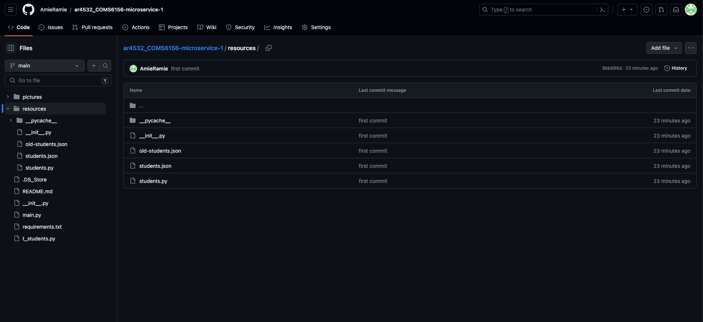
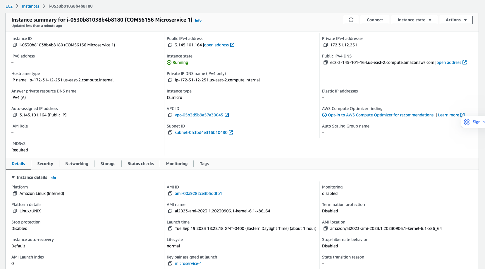
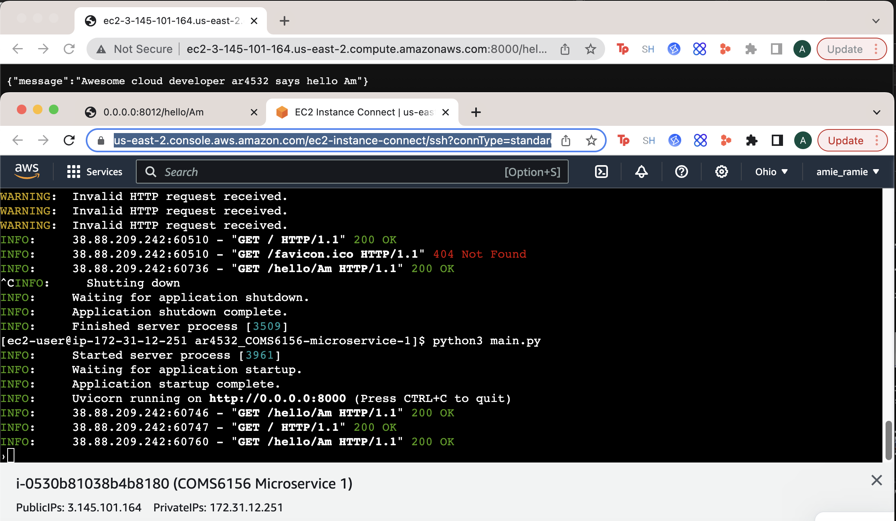

# E6156 - Topics in SW Engineering: Cloud Computing First Example Microservice

__Author:__ Amrit Ramesh

### Directory

|  |
| :---: |
| __File Explorer__ |

|  |
| :---: |
| __Modified Code__ |

Here is my file directory

### Starter Project Executed

|  |
| :---: |
| __Executing Script__ |

Here you can see that we have started the flask server in main.py and sent a request to the /hello endpoint

### Publish to personal GitHub repository

|  |
| :---: |
| __Personal Repo with Project__ |

I cloned the starter repo Professor Ferguson made, deleted the .git file, created a new repo, and pushed all updates to that repo. This is that result

### Deploying Project on AWS

|  |
| :---: |
| __Information about EC2 VM__ |

|  |
| :---: |
| __Microservice Running on AWS__ |

Due to some issues that I wasn't able to solve with FastAPI I could only access the public url AWS gave me using http vs https. It does not work with https.

Here is my repo: https://github.com/AmieRamie/ar4532_COMS6156-microservice-1/tree/main
And though I may have stopped the instance by the time you start grading, here is the link to the app: http://ec2-3-145-101-164.us-east-2.compute.amazonaws.com:8000/hello/Am

