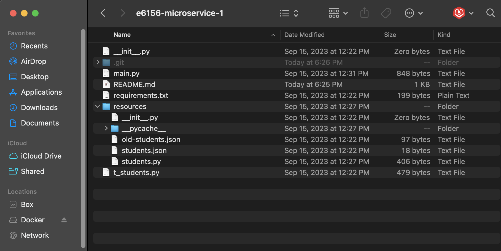
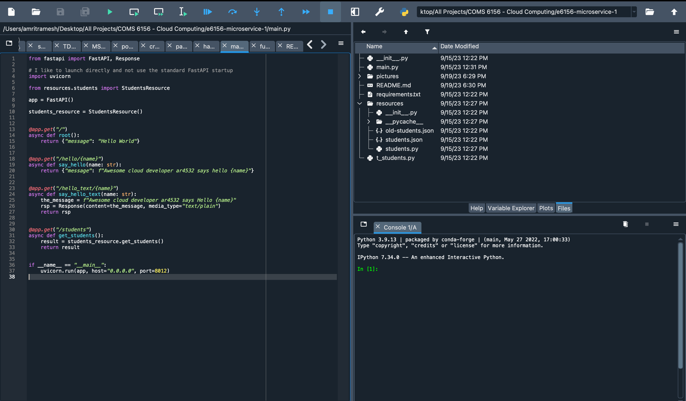
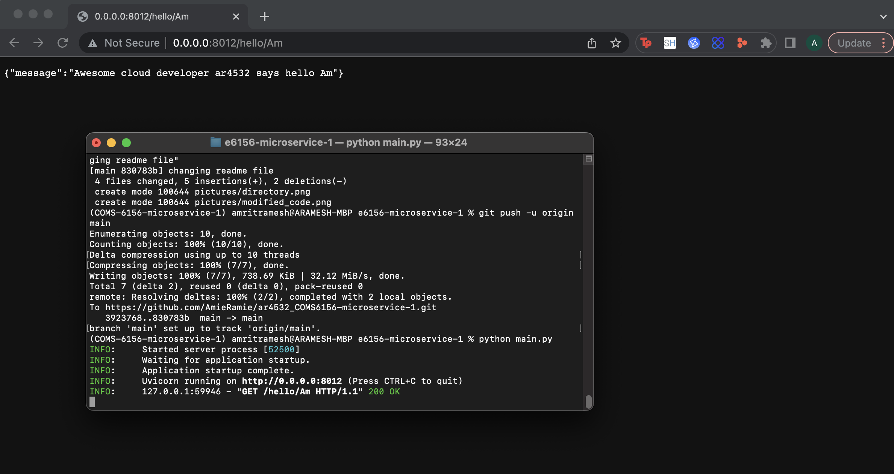

# E6156 - Topics in SW Engineering: Cloud Computing First Example Microservice

__Author:__ Amrit Ramesh

### Directory

|  |
| :---: |
| __File Explorer__ |

|  |
| :---: |
| __Modified Code__ |

Here is my file directory

### Starter Project Executed

|  |
| :---: |
| __Executing Script__ |

Here you can see that we have started the flask server in main.py and sent a request to the /hello endpoint

### Publish

__Note:__
- The default behavior for virtual environment creation is to
create the venv in the current folder/project.
- You can create the venv anywhere on the file system.
- You do not want to venv pushed to GitHub. So, if the venv is inside the
project, remove the directory from the set of files that will be pushed.
The easiest way is to add to a [.gitignore file.](https://git-scm.com/docs/gitignore)

 

- Commit and push your application to the GitHub repository.

- You have completed the first part of the initial assignment.

